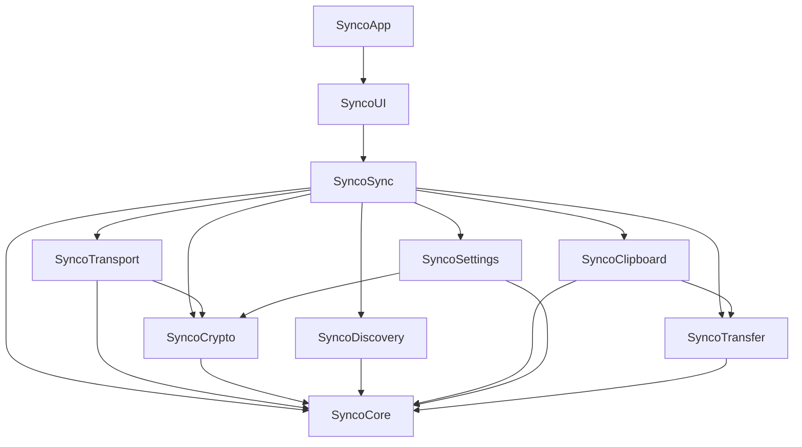

# Synco for macOS

Synco keeps the clipboard on this Mac and the clipboard on an Android phone in sync over
the local network. Copy on one device, paste on the other. Text, rich text, HTML, URLs,
images, and files — including whole folders dragged from the Finder — all move across.

There is no account, no broker, and no cloud. Devices find each other with Bonjour, connect
directly over TCP, and every byte after the handshake is encrypted with keys that exist
only for the lifetime of that connection. Trust is established once, by a human comparing a
fingerprint on both screens.

The Mac side is a menu bar app with no Dock icon (`LSUIElement`). Everything happens in the
popover behind the status item, plus a Settings window.

The wire format is specified in [PROTOCOL.md](PROTOCOL.md), which is shared byte for byte
with the Android repository. Read it before changing anything that touches the network.

Requires macOS 14 or later and Swift 6.

---

## Architecture

The package builds two products from ten targets: the `Synco` executable (target
`SyncoApp`) and a `SyncoKit` library that vends `SyncoSync`.



| Target | Responsibility |
|--------|----------------|
| `SyncoCore` | The wire contract with no I/O: constants, `DeviceID`, `Fingerprint`, base32/hex, length-prefixed framing, blob chunks, every `ControlMessage`, and the canonical clip hash. |
| `SyncoCrypto` | X25519 identity in the keychain, the ephemeral handshake, HKDF key schedule, HMAC confirmation, and the ChaCha20-Poly1305 session cipher. |
| `SyncoTransport` | `NWConnection`/`NWListener` wrapped as `FramedConnection`, plus `PeerSession` — handshake, pairing exchange, keepalive, receive loop, reconnect backoff. |
| `SyncoDiscovery` | Bonjour advertising and browsing, TXT record encode/decode, and the `NWPathMonitor` that notices the network moved. |
| `SyncoTransfer` | Streamed blobs: staging, chunking, SHA-256 verification, size limits, destination paths, progress. |
| `SyncoClipboard` | `NSPasteboard` reading and writing, representation ordering, inline/blob demotion, and the loop-suppression window. |
| `SyncoSettings` | The on-disk settings document, trusted peers, per-peer direction policy, and the login item. |
| `SyncoSync` | The composition layer: `SyncoGraph` builds the object graph, `SyncEngine` runs the loops, `PeerRegistry` decides who to dial, `ClipRouter` moves clips both ways, `SyncState` is the observable view of it all. |
| `SyncoUI` | SwiftUI menu bar popover, pairing window, and Settings window over `SyncState` and `SyncCommands`. |
| `SyncoApp` | `NSApplication` bootstrap, accessory activation policy, graceful shutdown. |

Dependencies point in one direction only. `SyncoCore` knows about nothing; `SyncoSync` is
the only target allowed to know about all of them.

---

## Discovery over Bonjour

Every device advertises and browses at the same time.

**Advertising.** `SyncEngine` opens an `NWListener` on an OS-chosen ephemeral port, then
`BonjourAdvertiser` attaches a service to it:

- service type `_synco._tcp`, domain `local.`
- instance name is the 16-character device id — never the human name, because instance
  names must be stable and collision-free
- `noAutoRename` is set, so a device id collision fails loudly instead of silently becoming
  `abcdefghij234567 (2)`

The TXT record carries `v` (protocol version), `did` (device id), `dn` (display name, UTF-8
truncated to 63 bytes), `pl` (`macos`), and `fp` (fingerprint hex without separators).
Renaming the Mac in Settings republishes the record; it does not drop connections.

**Browsing.** `BonjourBrowser` runs an `NWBrowser` with `.bonjourWithTXTRecord`, parses each
result's TXT record into a `ServiceAdvertisement`, drops its own device id, and emits
`peerAppeared` / `peerChanged` / `peerDisappeared`. Results that fail version or field
validation are ignored rather than surfaced.

**Who dials.** Both devices would otherwise dial each other and race. The tie is broken by
comparing the two device id strings: the lexicographically smaller `did` dials, the larger
one waits. That is why a paired peer can sit at "Waiting for peer" — it is the listening
half, and this is normal.

**Network changes.** `PathMonitorService` watches `NWPath`. When the set of available
interfaces changes — Wi-Fi to Ethernet, a network switch, wake from sleep — the advertiser
restarts and browsing starts over. When no interface is available at all, the popover shows
a "No local network" banner. Because a peer is always re-resolved from its `did` at connect
time, a new IP address after a DHCP renewal needs no user action.

Reconnect uses exponential backoff with full jitter, 1s base to a 30s cap, reset on a
successful handshake. A peer that disappears from mDNS cancels its pending backoff
immediately.

---

## Building and packaging

Development build and tests:

```sh
swift build
swift test
```

`swift run Synco` will launch the binary, but see the next section before relying on it —
an unbundled binary cannot discover anything.

Build a real, signed app bundle:

```sh
./Scripts/package-app.sh
open dist/Synco.app
```

`package-app.sh` does a `swift build -c release --product Synco`, assembles
`dist/Synco.app` from that binary plus `Resources/Info.plist`, copies
`Resources/Synco.icns` if it is present, then ad-hoc signs the bundle with
`Resources/Synco.entitlements` and the hardened runtime and verifies the signature.

Install into `/Applications`:

```sh
./Scripts/install.sh
```

`install.sh` runs `package-app.sh` first, quits a running copy, `ditto`s the bundle to
`/Applications/Synco.app`, offers to register a login item, and opens the app. If
`/Applications` is not writable it tells you to re-run with `sudo`. Run it from an
interactive shell — non-interactive runs skip the login item prompt.

`dist/` is gitignored.

### Why the .app bundle is not optional

Two capabilities are granted by macOS to *app bundles*, not to executables:

**Local network access.** macOS 15 and later gate mDNS and local TCP behind a per-app
permission. The system reads `NSBonjourServices` and `NSLocalNetworkUsageDescription` out
of the bundle's `Info.plist` and keys the grant to the bundle identifier (`app.synco`) and
code signature. A bare `.build/debug/Synco` has no `Info.plist` and no bundle identifier at
all, so those keys are never read, the prompt is never attributed to Synco, and browsing
returns nothing while advertising goes nowhere.

**Launch at login.** `SMAppService.mainApp` requires a real bundle. `LaunchAtLogin.isSupported`
checks that `Bundle.main.bundleIdentifier` is non-nil and the bundle path ends in `.app`;
outside a bundle it reports `.unavailable`, and the Settings toggle is disabled with an
explanatory note.

The app detects this itself. `BundleEnvironment.report()` logs a notice at startup when it
is running outside `Synco.app`, telling you to run `Scripts/package-app.sh`. Use
`swift build` and `swift test` for the compile-and-unit-test loop; use the packaged bundle
for anything that has to actually talk to a phone.

---

## First run

1. Package and open the app: `./Scripts/package-app.sh && open dist/Synco.app`. A menu bar
   item appears — there is no Dock icon and no window until you click it.

2. **Approve the local network prompt.** macOS asks whether Synco may find devices on your
   local network, showing the string from `NSLocalNetworkUsageDescription`. Allow it. If
   you dismiss or deny it, discovery stays empty forever; see Troubleshooting.

3. Open Synco on the phone, with both devices on the same Wi-Fi network. Within a few
   seconds the phone appears in the popover under **Nearby**, marked "Not paired". If the
   list is empty it says so and tells you what to check.

4. Click **Pair** next to the phone. A pairing window opens on the Mac and a matching
   dialog opens on the phone.

5. **Compare the fingerprints.** Both screens show four groups of four uppercase hex
   characters, like `A1B2-C3D4-E5F6-0718`. They are derived from the peer's long-term public
   key, so they will match only if you are talking to the device you think you are. Read
   them off both screens and confirm they are identical. If they differ, do not pair —
   something else on the network is answering.

6. Approve on both devices. Nothing secret crosses the wire during pairing; the approval is
   what turns a public key into a trusted one. Once both sides have approved, the pairing
   connection closes and a fresh one is dialed that runs the full authenticated handshake.
   The peer moves to **Paired** and the status dot turns green — "Connected".

Copy something. It should land on the other device immediately.

The pairing decision is remembered in the settings file. Rejecting a device marks it
rejected and Synco will not prompt again until you clear it by pairing from the popover
deliberately.

---

## Sync direction

Direction is enforced independently on both devices. A single toggle is never trusted to a
single side, and each device also announces what it accepts and sends so the other UI can
explain why something did not sync.

The popover has one four-way control. It sets the **default policy for every peer that does
not have its own direction set**, plus the global pause switch:

| Button | Send flags | Receive flags | Paused |
|--------|-----------|---------------|--------|
| **Both ways** | text, images, files | text, images, files | no |
| **Mac to phone** | text, images, files | none | no |
| **Phone to Mac** | none | text, images, files | no |
| **Paused** | unchanged | unchanged | yes |

"Paused" does not clear anything. It flips one global switch that forces the effective send
and receive flags to empty in both directions; the stored per-type choices are preserved and
come back exactly as they were when you unpause. While paused, the per-type toggles are
shown disabled.

Expand a paired device in the popover for per-device control that overrides the default:

- a **Direction** menu with Both ways / Receive only / Send only / Off
- six type toggles — Text, Images, Files, once for **Send to** that device and once for
  **Receive from** it

So "phone to Mac only" is the phone sending and the Mac receiving, with the Mac sending
nothing and the phone receiving nothing. Either device refusing is enough to stop the flow.
Below the toggles Synco shows what the other device says it accepts and sends, so you can
see when the two sides disagree.

---

## Where things land

| What | Where |
|------|-------|
| Received files and images | `~/Downloads/Synco` |
| Received folders | rebuilt under `~/Downloads/Synco`, preserving the copied folder's structure |
| Settings | `~/Library/Application Support/app.synco/settings.json` |
| In-flight transfer parts | `~/Library/Application Support/app.synco/Staging` |
| Long-term private key | login keychain, service `app.synco.identity` |

A received file is written to the staging directory first, verified against the SHA-256 the
sender announced, and only then moved into `~/Downloads/Synco`. A digest mismatch or a short
transfer discards the partial file and the clip is never applied — either the whole
clipboard event lands or none of it does. Name collisions get a numeric suffix rather than
overwriting anything. Staging is emptied when Synco stops.

Received images go on the pasteboard *and* stay on disk in `~/Downloads/Synco`, so a paste
that you miss is still recoverable. The Settings window shows the path and has a **Reveal in
Finder** button.

The largest single item Synco will accept is configurable in Settings (10 MB through 1 GB,
default 100 MB). Anything larger is refused with a reason the sending device can display,
rather than silently filling your disk.

---

## Why the App Sandbox is not enabled

`Resources/Synco.entitlements` sets `com.apple.security.app-sandbox` to `false` and keeps
only `com.apple.security.network.client` and `com.apple.security.network.server`. JIT,
unsigned executable memory, and library validation bypass are all explicitly off.

Synco is distributed as a directly installed app, not through the Mac App Store, so the
sandbox is not required — and enabling it would break three things this app is built to do:

- **Received files would not go where you can find them.** The destination is resolved with
  `FileManager.urls(for: .downloadsDirectory, in: .userDomainMask)`. Inside a sandbox that
  resolves to the app's private container, so `~/Downloads/Synco` in the UI and the real
  `~/Downloads/Synco` would be different folders.
- **Copied folders could not be walked.** When you copy a directory in the Finder, Synco
  enumerates it and sends each regular file with a relative path so the receiver can rebuild
  the tree. A sandboxed app does not get that access from a pasteboard file URL.
- **The identity key could not live in the login keychain.** The long-term X25519 private
  key is stored as a generic password under service `app.synco.identity`. A sandboxed app
  needs a `keychain-access-groups` entitlement scoped to a real signing team, and
  `package-app.sh` signs ad hoc (`codesign --sign -`) — there is no team to scope it to.

The tradeoff is deliberate and narrow: the app talks to one port on the local network and
one folder in your home directory, and both are visible in the UI.

---

## Troubleshooting

**Nothing appears under Nearby.**

- Confirm you are running `dist/Synco.app` or `/Applications/Synco.app`, not
  `.build/debug/Synco`. Check with
  `log stream --predicate 'subsystem == "app.synco"' --level info` — an unbundled run logs a
  notice saying local network permission and launch at login are unavailable.
- Confirm both devices are on **the same subnet**. Two devices on the same router but on a
  guest network, on separate VLANs, or on SSIDs that a mesh system keeps isolated cannot see
  each other's mDNS. A full-tunnel VPN on either device will also hide them from each other.
- Confirm the access point does not have **AP isolation** (also called client isolation,
  station isolation, or "wireless isolation") enabled. It is common on guest and hotel
  networks and it blocks device-to-device traffic entirely, including mDNS to
  `224.0.0.251:5353`. There is no workaround from inside the app: use a network without it.
- Check the macOS firewall: System Settings → Network → Firewall. If it is on, Synco needs
  to be allowed to receive incoming connections.

**Local network permission was denied.**

Open System Settings → Privacy & Security → Local Network and turn Synco on. Then quit Synco
from the popover and reopen it — the permission is read at listener start.

If Synco is not in that list at all, macOS never asked, which means it was never launched
from an app bundle. Run `./Scripts/package-app.sh` and open `dist/Synco.app`.

If Synco is in the list, already switched on, and still finds nothing: the grant is keyed to
the bundle identifier *and* the code signature, and every `package-app.sh` run produces a
fresh ad-hoc signature. macOS can end up holding a stale entry for a signature that no longer
exists. Toggle Synco off and back on in that pane, or delete the installed bundle, repackage,
reinstall, and approve the prompt again.

**A paired device sits at "Waiting for peer".**

That is the listening half of the pair. The device with the lexicographically smaller device
id dials; this one waits. If the other device is running and on the same network, a
connection should follow within a backoff interval — up to 30 seconds.

**The Settings login item toggle is greyed out.**

Launch at login needs a real app bundle. Run from `dist/Synco.app` or install to
`/Applications`. If the toggle is on but macOS says it is waiting for approval, the Settings
section offers an **Open Login Items** button that takes you straight to the right pane.

**Reading the logs.**

```sh
log stream --predicate 'subsystem == "app.synco"' --level info
```

Categories are `app`, `session`, `transport`, `discovery`, `transfer`, `clipboard`,
`settings`, `crypto`, `core`, and `ui`; narrow with
`subsystem == "app.synco" and category == "discovery"`.

---

## Icons

Synco ships with no artwork of its own. Two things need to be supplied, and they are
independent.

**App icon.** Drop the file at:

```
Resources/Synco.icns
```

That exact path and filename is what `Scripts/package-app.sh` looks for; when it exists the
script installs it into `dist/Synco.app/Contents/Resources/Synco.icns`, and
`Resources/Info.plist` already declares `CFBundleIconFile` as `Synco.icns`. Nothing else has
to change — no code, no plist edit. When the file is absent the script silently skips it and
the bundle gets the generic application icon.

**Menu bar icon.** There is currently no image asset for the status item. It is drawn from
SF Symbols in:

```
Sources/SyncoUI/StatusItemIcon.swift
```

`StatusItemIcon.image()` builds an `NSImage(systemSymbolName:accessibilityDescription:)` and
sets `isTemplate = true` so the glyph follows the menu bar's light and dark appearance. The
five states and the symbols standing in for them are:

| State | SF Symbol |
|-------|-----------|
| `idle` | `square.on.square.dashed` |
| `connected` | `square.on.square` |
| `syncing` | `arrow.triangle.2.circlepath` |
| `paused` | `pause.circle` |
| `attention` | `exclamationmark.triangle.fill` |

To replace them with custom art, supply five template images — monochrome, alpha-only,
around 18×18 points — and change `image()` to load them instead of the symbol names. Note
that `SyncoUI` currently declares no resources in `Package.swift`, so shipping image files
inside the target requires a manifest change before `Bundle.module` will exist.

---

## License

MIT. See [LICENSE](LICENSE).
